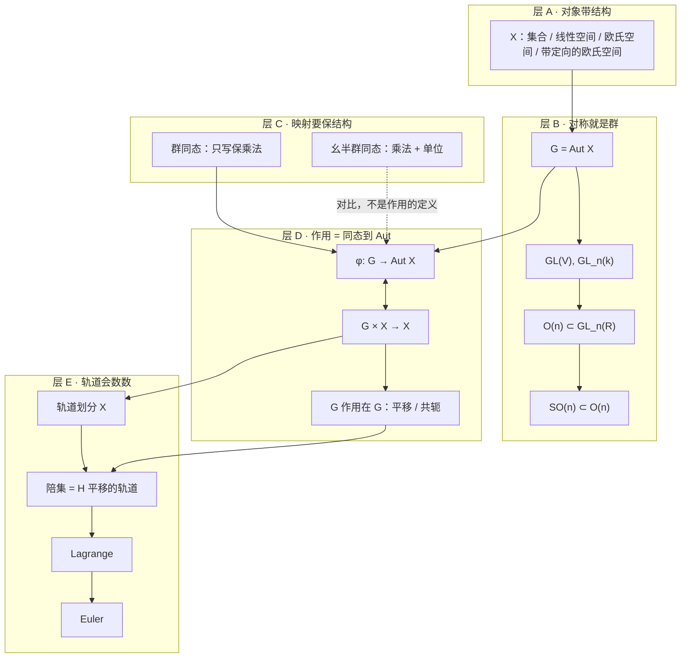
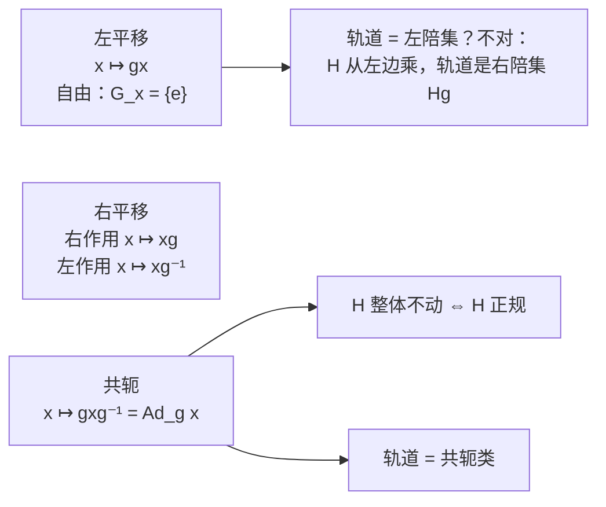

# 知识体系 · MATH5111

目前只上过一课。下面按**一条主线**收纳，而不是按板书页码平铺。

扫读顺序：先看地图，再看四层卡片，最后看「容易混的三对」。

---

## 0. 一张地图



**一句话：** 群是对称；同态是对称之间的翻译；作用是把抽象群翻译成具体对称；轨道是翻译之后的「看得见的块」；Lagrange 只是在有限时数这些块。

---

## 1. 层 A–B · 结构越多，对称越少

把「群从哪里来」钉死：先有对象，再有 \(\mathrm{Aut}\)。

| 对象 \(X\) | 被保住的结构 | \(\mathrm{Aut}\,X\) | 你会丢掉什么 |
| --- | --- | --- | --- |
| 有限集 \(\{1,\dots,n\}\) | 没有额外结构 | \(S_n\) | — |
| \(k\)-线性空间 \(V\) | 线性 | \(GL(V)\cong GL_n(k)\) | 非线性双射 |
| 欧氏空间 \((\mathbb{R}^n,\langle,\rangle)\) | 线性 + 内积 | \(O(n)\) | 不保长度/角度的可逆线性映射 |
| 再加 standard orientation | 上面 + 定向 | \(SO(n)\) | 反射（\(\det=-1\)） |

```text
  全部可逆线性映射          保内积            再保定向
 GL_n(R)  ⊃  O(n)  ⊃  SO(n)
   大                  中              小
```

阅读板书时的默认语法：

\[
\text{看见 }GL,\;O,\;SO\quad\Longleftrightarrow\quad\text{先问：Aut 的是哪一个 }X\text{？}
\]

---

## 2. 层 C · 同态：群比幺半群「便宜」

### 为什么群的 (2)(3) 是冗余的

只假设 \(\varphi(ab)=\varphi(a)\varphi(b)\)。

1. \(\varphi(e)=\varphi(ee)=\varphi(e)\varphi(e)\)，两边左乘 \(\varphi(e)^{-1}\) 得 \(\varphi(e)=e\)。
2. \(\varphi(a)\varphi(a^{-1})=\varphi(aa^{-1})=\varphi(e)=e\)，故 \(\varphi(a^{-1})=\varphi(a)^{-1}\)。

群里每个元素都有逆，才能做第 1 步的「消去」。幺半群没有逆，这条路断了，所以必须**另写** \(\varphi(e)=e\)。

### 对照卡

```text
┌──────────────────────┐     ┌──────────────────────────┐
│ 群同态               │     │ 幺半群同态               │
│ φ(ab)=φ(a)φ(b)  一条就够 │     │ φ(ab)=φ(a)φ(b)           │
│ 单位、逆自动跟上     │     │ 且必须 φ(e)=e            │
└──────────────────────┘     └──────────────────────────┘
```

课堂例子：\((\mathbb{Z}/6\mathbb{Z},\times)\) 是幺半群，不是群。单位群是里面「真的可逆」的那一小撮：

\[
\{\bar 1,\bar 5\}\cong\mathbb{Z}/2\mathbb{Z},\qquad \bar 2\cdot\bar 3=\bar 0.
\]

---

## 3. 层 D · 作用：同一件事的两种写法

### 字典

| 作用语言 | 同态语言 |
| --- | --- |
| \(g\cdot x\) | \(\phi(g)(x)\) |
| \(e\cdot x=x\) | \(\phi(e)=\mathrm{id}_X\) |
| \(g_1\cdot(g_2\cdot x)=(g_1g_2)\cdot x\) | \(\phi(g_1g_2)=\phi(g_1)\circ\phi(g_2)\) |
| 稳定化子 \(G_x=\{g\mid g\cdot x=x\}\) | \(\phi(g)\) 固定 \(x\) 的那些 \(g\) |
| 轨道 \(G\cdot x=\{g\cdot x\}\) | \(x\) 在 \(\phi(G)\) 下的像 |

### \(G\) 作用在 \(G\) 上：三套标准动作



**左 / 右千万别凭语感：**

- \(H\) **左乘** \((h,g)\mapsto hg\)，过 \(g\) 的轨道是 \(\{hg\}=Hg\)，名字却叫 **右陪集**。
- 右乘的轨道才是左陪集 \(gH\)。
- 记号：右陪集空间 \(H\backslash G\)，左陪集空间 \(G/H\)。斜杠靠哪边，陪集就写在哪边。

### 共轭的两件事（板书证明了第一件）

1. 每个 \(\mathrm{Ad}_g\) 是群同构 \(G\to G\)（板书验了保积）。
2. \(\mathrm{Ad}:G\to\mathrm{Aut}\,G\) 本身是群同态。

正规子群的图景：

```text
        g (·) g⁻¹
   H  ────────────►  gHg⁻¹
   │                    │
   └── 相等（作为集合）─┘   ⇔   H ◃ G

   单个 h  可以变成  另一个 h' ∈ H
   被钉住的是整堆 H，不是每个点
```

---

## 4. 层 E · 划分，然后数数

三件套是同一模式：

| 来源 | 块是什么 | 块的名字 |
| --- | --- | --- |
| \(G\) 作用在 \(X\) | \(\{y\mid y=g\cdot x\}\) | 轨道 |
| 满射 \(f:X\to Y\) | \(f^{-1}(y)\) | 纤维 |
| \(H\) 平移作用在 \(G\) | \(Hg\) 或 \(gH\) | 陪集 |

通用公式：

\[
X=\coprod_{\alpha\in I} G\cdot x_\alpha,
\qquad
|X|<\infty\ \Rightarrow\ |X|=\sum_{\alpha}|G\cdot x_\alpha|.
\]

### Lagrange 只是「轨道一样大」

对平移作用，板书给了集合双射

\[
H\xrightarrow{\;\sim\;}Hg,\quad h\mapsto hg
\qquad\text{以及}\qquad
H\xrightarrow{\;\sim\;}gH,\quad h\mapsto gh.
\]

所以每个轨道的基数都是 \(|H|\)，代入通用公式：

\[
|G|=|H|\cdot(\text{陪集个数}).
\]

这就是 \(o(H)\mid o(G)\)。指数 \([G:H]\) 就是那个陪集个数。

```text
G 被切成同样大小的砖
┌────┬────┬────┬────┐
│ H  │ Hg │ …  │    │   每块 |H| 个点
└────┴────┴────┴────┘
|G| = |H| × 块数
```

### 几何对照：\(SO(2)\) 不数有限个数，但同一套词

| | 非原点 \(x\) | 原点 \(O\) |
| --- | --- | --- |
| 稳定化子 | \(\{e\}\) | 整个 \(SO(2)\) |
| 轨道 | 圆 | 单点 \(\{O\}\) |
| 直观 | 转一下就走 | 怎么转都在 |

稳定化子越大，轨道越小。有限时这就是轨道–稳定化子公式的雏形；本课只用了「平移作用稳定化子平凡 \(\Rightarrow\) 轨道 \(\cong H\)」。

### Euler 是 Lagrange 的数论特化

\[
G=(\mathbb{Z}/n\mathbb{Z})^\times,\qquad |G|=\varphi(n).
\]

\(\gcd(a,n)=1\) \(\Rightarrow\) \(\bar a\in G\)。\(\langle\bar a\rangle\le G\)，Lagrange 给出 \(\mathrm{ord}(\bar a)\mid\varphi(n)\)，于是

\[
a^{\varphi(n)}\equiv 1\pmod n.
\]

---

## 5. 容易混的三对

### 5.1 群同态 vs 幺半群同态

只差「要不要写 \(\varphi(e)=e\)」。差的原因是有没有逆，不是文字习惯。

### 5.2 左陪集 vs 右陪集

| | 左陪集 | 右陪集 |
| --- | --- | --- |
| 元素 | \(gH=\{gh\}\) | \(Hg=\{hg\}\) |
| 来自哪种平移 | \(H\) 右乘 | \(H\) 左乘 |
| 空间 | \(G/H\) | \(H\backslash G\) |
| 何时重合 | \(H\trianglelefteq G\)（对所有 \(g\)，\(gH=Hg\)） | 同左 |

集合上永远有 \(Hg\cong H\cong gH\)；作为 \(G\) 的子集，\(Hg=gH\) 不是永远成立。

### 5.3 作用公理里的乘法顺序

左作用要的是 \(\phi(g_1g_2)=\phi(g_1)\circ\phi(g_2)\)。  
若你坚持写「先写元素再乘 \(g\)」，必须改成 \(x\mapsto xg^{-1}\)，否则 \((g_1g_2)\) 会对不上。板书两种写法都出现过，不是笔误。

---

## 6. 本课知识清单（按可检验目标）

- [ ] 能从对象的结构读出 \(GL_n\)、\(O(n)\)、\(SO(n)\)。
- [ ] 能说明群同态为何不必单列单位和逆。
- [ ] 能在「作用」和「\(G\to\mathrm{Aut}\,X\)」之间互译。
- [ ] 能写出 \(G\) 上的左平移、右平移（含 \(g^{-1}\)）、共轭，并指出共轭的轨道叫共轭类。
- [ ] 能用「共轭整体回到 \(H\)」说清 \(H\trianglelefteq G\)。
- [ ] 能指出 \(H\) 左乘的轨道是右陪集 \(Hg\)。
- [ ] 能用轨道划分 + \(Hg\cong H\) 推出 Lagrange。
- [ ] 能从 Lagrange 写出 Euler，并会算 \((\mathbb{Z}/6\mathbb{Z})^\times\)。
